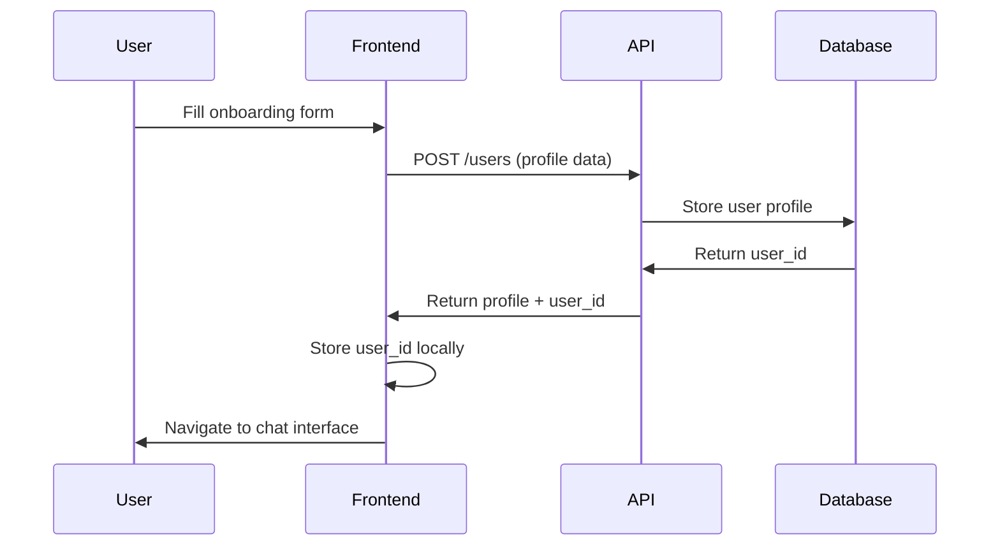
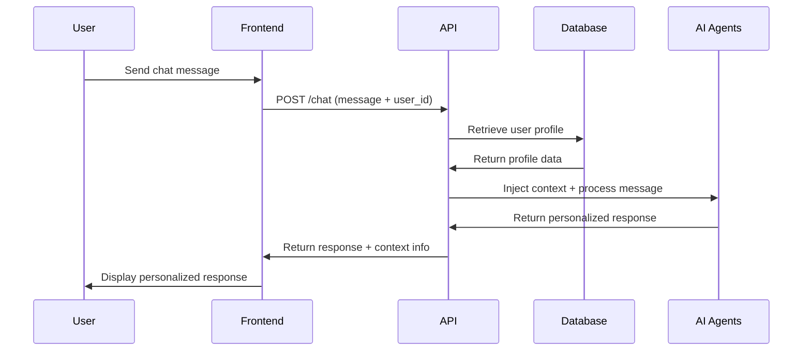

# Frontend Integration Guide

## Overview

The Inclusive Travel Agent now supports **personalized user profiles** and **context-aware AI responses**. This guide shows how to integrate your frontend onboarding app with the backend API to provide personalized accessibility-focused travel assistance.

## 🎯 System Architecture

```
Frontend Onboarding → Backend API → User Profile Storage → AI Agents
     ↓                    ↓              ↓                    ↓
User Profile Form → POST /users → Firestore/Memory → Context Injection
     ↓                    ↓              ↓                    ↓
Chat Interface   → POST /chat → Profile Retrieval → Personalized Responses
```

## 📋 User Profile Structure

### Complete User Profile Schema

```json
{
  "user_id": "uuid-string",
  "basic_info": {
    "name": "Sarah Johnson",
    "email": "sarah@example.com",
    "age": 34,
    "nationality": "US",
    "home_location": "Seattle, WA",
    "phone": "+1-555-0123",
    "emergency_contact": {
      "name": "John Johnson",
      "phone": "+1-555-0124",
      "relationship": "spouse"
    }
  },
  "travel_interests": {
    "preferred_destinations": ["Europe", "Japan"],
    "travel_style": ["cultural", "accessible"],
    "budget_range": "mid-range",
    "group_size_preference": "solo",
    "accommodation_preferences": ["accessible_hotel", "central_location"],
    "activity_interests": ["museums", "accessible_tours", "local_cuisine"],
    "transportation_preferences": ["accessible_public_transport", "taxi"]
  },
  "accessibility_profile": {
    "mobility_needs": ["wheelchair_accessible", "step_free_access"],
    "sensory_needs": ["hearing_assistance"],
    "cognitive_needs": [],
    "assistance_preferences": {
      "airport_assistance": "wheelchair_assistance",
      "boarding_preference": "priority_boarding",
      "hotel_assistance": "accessible_room_ground_floor"
    },
    "mobility_aids": ["manual_wheelchair", "hearing_aids"],
    "medical_conditions": ["hearing_impairment"],
    "accessibility_priorities": ["wheelchair_accessible", "accessible_restrooms"],
    "barrier_concerns": ["stairs", "narrow_doorways", "loud_environments"],
    "dietary_restrictions": ["gluten_free"],
    "medication_requirements": ["daily_medication"],
    "service_animal": null,
    "communication_needs": ["written_communication_backup"]
  },
  "preferences": {
    "communication_style": "detailed",
    "risk_tolerance": "low",
    "planning_horizon": "2_months",
    "language_preferences": ["English"],
    "currency_preference": "USD",
    "timezone": "America/Los_Angeles"
  },
  "created_at": "2024-11-02T10:30:00Z",
  "updated_at": "2024-11-02T10:30:00Z",
  "profile_complete": true,
  "onboarding_completed": true
}
```

## 🔌 API Endpoints

### Base URL
```
Production: https://your-cloud-run-service-url
Development: http://localhost:8080
```

### 1. Create User Profile

**Endpoint:** `POST /users`

**Request Body:**
```json
{
  "basic_info": {
    "name": "Sarah Johnson",
    "email": "sarah@example.com",
    "age": 34,
    "nationality": "US",
    "home_location": "Seattle, WA"
  },
  "travel_interests": {
    "preferred_destinations": ["Europe"],
    "travel_style": ["cultural", "accessible"],
    "budget_range": "mid-range"
  },
  "accessibility_profile": {
    "mobility_needs": ["wheelchair_accessible"],
    "assistance_preferences": {
      "airport_assistance": "wheelchair_assistance"
    }
  }
}
```

**Response:**
```json
{
  "user_id": "uuid-string",
  "profile": { /* full profile object */ },
  "message": "User profile created successfully"
}
```

### 2. Get User Profile

**Endpoint:** `GET /users/{user_id}`

**Response:**
```json
{
  "user_id": "uuid-string",
  "profile": { /* full profile object */ },
  "message": "User profile retrieved successfully"
}
```

### 3. Update User Profile

**Endpoint:** `PUT /users/{user_id}`

**Request Body:** (partial updates supported)
```json
{
  "travel_interests": {
    "preferred_destinations": ["Europe", "Japan", "Canada"]
  }
}
```

### 4. Chat with Context

**Endpoint:** `POST /chat`

**Request Body:**
```json
{
  "message": "I need help planning an accessible trip to Paris",
  "session_id": "user_session_123",
  "user_id": "uuid-string"  // Include for personalized responses
}
```

**Response:**
```json
{
  "response": "Hi Sarah! I'd love to help you plan an accessible trip to Paris. Based on your profile, I know you use a wheelchair and prefer detailed information...",
  "session_id": "user_session_123",
  "events": [ /* rich UI events */ ],
  "user_context": {
    "user_id": "uuid-string",
    "context_injected": true,
    "user_name": "Sarah Johnson",
    "accessibility_needs": true
  }
}
```

## 🎨 Frontend Implementation Examples

### React/TypeScript Example

```typescript
// types.ts
interface UserProfile {
  user_id: string;
  basic_info: BasicInfo;
  travel_interests: TravelInterests;
  accessibility_profile: AccessibilityProfile;
  preferences: UserPreferences;
}

interface ChatMessage {
  message: string;
  session_id: string;
  user_id?: string;
}

// userService.ts
class UserService {
  private baseUrl = 'https://your-api-url';

  async createUserProfile(profileData: CreateUserProfileRequest): Promise<UserProfile> {
    const response = await fetch(`${this.baseUrl}/users`, {
      method: 'POST',
      headers: { 'Content-Type': 'application/json' },
      body: JSON.stringify(profileData)
    });
    
    if (!response.ok) throw new Error('Failed to create profile');
    const result = await response.json();
    return result.profile;
  }

  async getUserProfile(userId: string): Promise<UserProfile> {
    const response = await fetch(`${this.baseUrl}/users/${userId}`);
    if (!response.ok) throw new Error('Profile not found');
    const result = await response.json();
    return result.profile;
  }

  async chatWithContext(message: ChatMessage): Promise<ChatResponse> {
    const response = await fetch(`${this.baseUrl}/chat`, {
      method: 'POST',
      headers: { 'Content-Type': 'application/json' },
      body: JSON.stringify(message)
    });
    
    if (!response.ok) throw new Error('Chat failed');
    return await response.json();
  }
}

// OnboardingComponent.tsx
const OnboardingComponent: React.FC = () => {
  const [profile, setProfile] = useState<Partial<UserProfile>>({});
  const userService = new UserService();

  const handleSubmit = async () => {
    try {
      const createdProfile = await userService.createUserProfile({
        basic_info: profile.basic_info!,
        travel_interests: profile.travel_interests,
        accessibility_profile: profile.accessibility_profile
      });
      
      // Store user_id for chat sessions
      localStorage.setItem('user_id', createdProfile.user_id);
      
      // Navigate to chat interface
      router.push('/chat');
    } catch (error) {
      console.error('Failed to create profile:', error);
    }
  };

  return (
    <form onSubmit={handleSubmit}>
      {/* Your onboarding form fields */}
    </form>
  );
};

// ChatComponent.tsx
const ChatComponent: React.FC = () => {
  const [messages, setMessages] = useState<ChatMessage[]>([]);
  const [sessionId] = useState(() => `session_${Date.now()}`);
  const userId = localStorage.getItem('user_id');
  const userService = new UserService();

  const sendMessage = async (messageText: string) => {
    try {
      const response = await userService.chatWithContext({
        message: messageText,
        session_id: sessionId,
        user_id: userId || undefined
      });

      setMessages(prev => [...prev, {
        text: messageText,
        sender: 'user'
      }, {
        text: response.response,
        sender: 'agent',
        context: response.user_context
      }]);
    } catch (error) {
      console.error('Chat failed:', error);
    }
  };

  return (
    <div className="chat-interface">
      {/* Your chat UI */}
    </div>
  );
};
```

### Vue.js Example

```vue
<!-- UserProfile.vue -->
<template>
  <form @submit.prevent="createProfile">
    <!-- Basic Info -->
    <section>
      <h2>Basic Information</h2>
      <input v-model="profile.basic_info.name" placeholder="Full Name" required />
      <input v-model="profile.basic_info.email" type="email" placeholder="Email" required />
      <input v-model="profile.basic_info.nationality" placeholder="Nationality" required />
    </section>

    <!-- Accessibility Profile -->
    <section>
      <h2>Accessibility Needs</h2>
      <div class="checkbox-group">
        <label v-for="need in mobilityOptions" :key="need">
          <input 
            type="checkbox" 
            :value="need" 
            v-model="profile.accessibility_profile.mobility_needs"
          />
          {{ need }}
        </label>
      </div>
    </section>

    <button type="submit">Create Profile</button>
  </form>
</template>

<script setup lang="ts">
import { ref } from 'vue';
import { useRouter } from 'vue-router';

const router = useRouter();
const profile = ref({
  basic_info: {
    name: '',
    email: '',
    nationality: '',
    home_location: ''
  },
  accessibility_profile: {
    mobility_needs: [],
    assistance_preferences: {}
  }
});

const mobilityOptions = [
  'wheelchair_accessible',
  'step_free_access',
  'mobility_aid_friendly'
];

const createProfile = async () => {
  try {
    const response = await fetch('/api/users', {
      method: 'POST',
      headers: { 'Content-Type': 'application/json' },
      body: JSON.stringify(profile.value)
    });

    const result = await response.json();
    localStorage.setItem('user_id', result.user_id);
    router.push('/chat');
  } catch (error) {
    console.error('Profile creation failed:', error);
  }
};
</script>
```

## 🔄 Integration Flow

### 1. User Onboarding Flow



### 2. Chat with Context Flow



## 🎯 Personalization Features

### What Gets Personalized

1. **Agent Responses**
   - Communication style (brief, detailed, conversational)
   - Risk tolerance considerations
   - Accessibility-first recommendations

2. **Content Focus**
   - Destinations matching user interests
   - Activities suitable for accessibility needs
   - Transportation options for mobility aids

3. **Assistance Coordination**
   - Automatic inclusion of preferred assistance types
   - Proactive barrier identification
   - Personalized preparation checklists

### Example Personalized Response

**Without Context:**
> "I can help you plan a trip to Paris. What dates are you thinking?"

**With Context (Sarah's profile):**
> "Hi Sarah! I'd love to help you plan an accessible trip to Paris. Based on your profile, I know you use a wheelchair and prefer detailed information. I'll make sure to focus on wheelchair-accessible attractions, hotels with ground-floor accessible rooms, and transportation options that accommodate your manual wheelchair. What dates are you considering for your trip?"

## 🛠️ Development Setup

### 1. Environment Variables

```bash
# .env file
GOOGLE_GENAI_USE_VERTEXAI=0
GOOGLE_API_KEY=your_google_ai_api_key
GOOGLE_CLOUD_PROJECT=your_project_id  # Optional for Firestore
GOOGLE_PLACES_API_KEY=your_places_api_key

# For production with Firestore
GOOGLE_CLOUD_PROJECT=your_production_project
```

### 2. Local Development

```bash
# Start the backend API
uv run uvicorn travel_concierge.main:app --reload --port 8080

# Test the API
curl -X POST http://localhost:8080/users \
  -H "Content-Type: application/json" \
  -d '{"basic_info": {"name": "Test User", "email": "test@example.com", "nationality": "US", "home_location": "Test City"}}'
```

### 3. Production Deployment

```bash
# Deploy to Cloud Run
uv run python deploy/deploy_cloud_run.py --project-id YOUR_PROJECT_ID
```

## 🔒 Security Considerations

### 1. User Data Protection
- All user profiles contain sensitive accessibility information
- Implement proper authentication and authorization
- Use HTTPS for all API communications
- Consider data encryption at rest

### 2. API Security
```typescript
// Add authentication headers
const headers = {
  'Content-Type': 'application/json',
  'Authorization': `Bearer ${userToken}`,
  'X-User-ID': userId  // For additional validation
};
```

### 3. Privacy Settings
- Allow users to control data sharing
- Implement data deletion requests
- Provide privacy controls in user preferences

## 📊 Monitoring and Analytics

### Key Metrics to Track
- Profile completion rates
- Context injection success rates
- User engagement with personalized responses
- Accessibility feature usage

### Example Monitoring Code
```typescript
// Track profile creation
analytics.track('profile_created', {
  user_id: profile.user_id,
  accessibility_needs_count: profile.accessibility_profile.mobility_needs.length,
  profile_complete: profile.profile_complete
});

// Track personalized chat usage
analytics.track('chat_with_context', {
  user_id: message.user_id,
  session_id: message.session_id,
  context_injected: response.user_context?.context_injected
});
```

## 🚀 Next Steps

1. **Implement User Authentication**
   - Add login/signup flow
   - Secure API endpoints
   - Implement session management

2. **Enhanced Personalization**
   - Learn from conversation history
   - Adaptive recommendations
   - Preference refinement over time

3. **Rich UI Components**
   - Accessibility-focused form components
   - Visual accessibility indicators
   - Personalized dashboard

4. **Offline Support**
   - Cache user profiles locally
   - Offline-first architecture
   - Sync when online

## 🎉 Success Metrics

Your integration is successful when:

✅ Users can complete onboarding and create profiles  
✅ Chat responses are personalized based on accessibility needs  
✅ Context persists across conversation sessions  
✅ Accessibility features are automatically considered  
✅ Users report more relevant and helpful responses  

## 📞 Support

For integration support:
- Check the API documentation at `/docs` endpoint
- Review test examples in `test_user_profile_system.py`
- Monitor logs for context injection success/failure
- Use the `/agent/info` endpoint to verify system capabilities

The system is now ready to provide personalized, accessibility-focused travel assistance to your users! 🌟